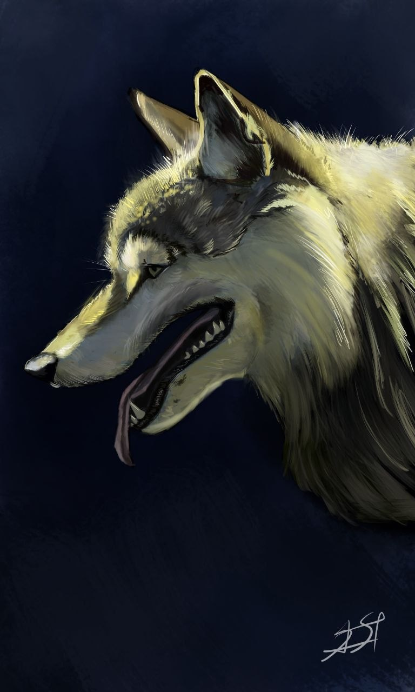

# sorrasoul

Портфолио сайт графического дизайнера Анастасии Поляковой.

Статический одностраничный сайт — HTML, CSS, vanilla JS, без сборки и зависимостей.

## Запуск локально

```bash
python3 -m http.server 8080
```

Открыть [http://localhost:8080](http://localhost:8080).

## Структура

```
index.html        — разметка (nav, hero, галерея, about, contact, лайтбокс)
css/style.css     — стили (дизайн-токены в :root)
js/main.js        — лайтбокс, свайп, навигация по клавишам, скролл-шпион
images/           — work-01.jpg … work-11.jpg
```

## Добавить новую работу

1. Положить изображение в `images/` (рекомендуемая ширина — до 1200 px).
2. В `index.html` добавить блок в секцию `#gallery`:

```html
<div class="gallery-item" data-index="11">
  
</div>
```

`data-index` должен быть последовательным — JS собирает элементы по порядку DOM.
